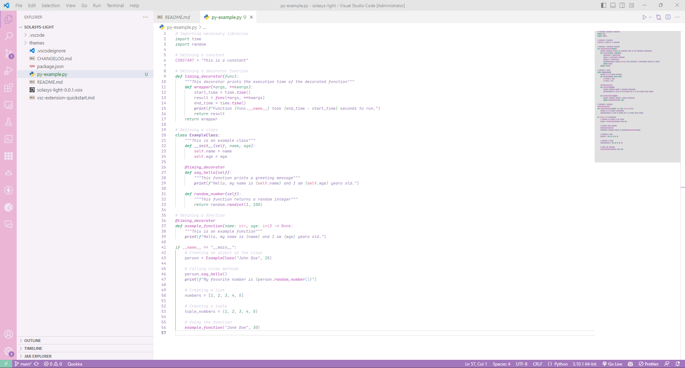
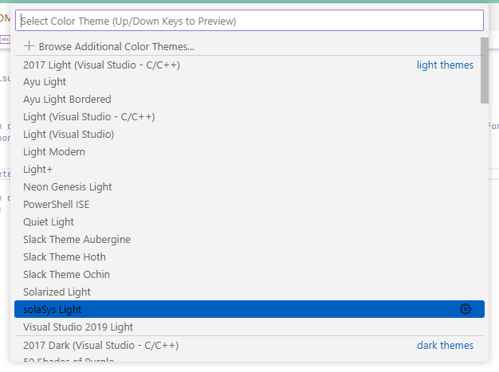

## solaSys Light
A light Python colour theme extension for Visual Studio Code that is not too harsh on the eyes.

## Description
Mainly focused on Python development, though works nicely for other languages. Please report any issues or requests for other languages as I have not tested it thoroughly with anything other than Python.

## Enable
When installation completes, select solaSys Light as your color theme (Preferences → Workbench: Color Theme → solaSys Light)

